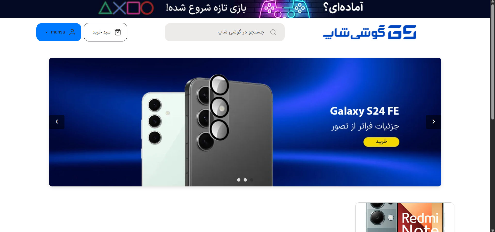
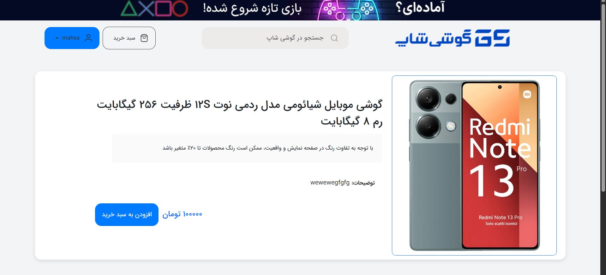
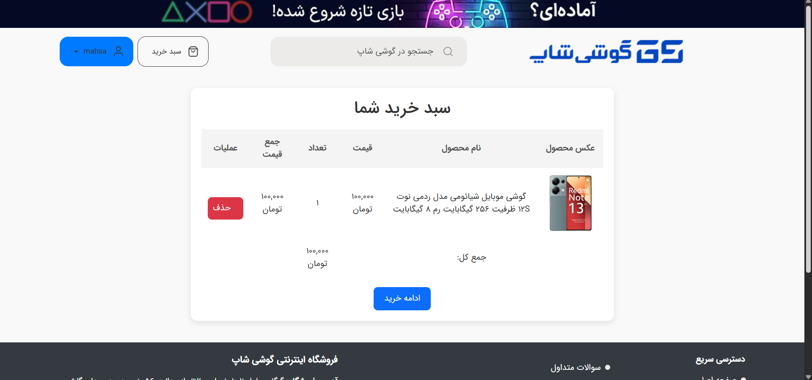
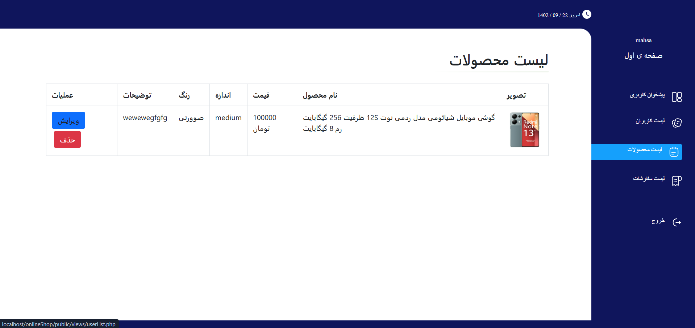

<h2 align="center"> GooshShop | فروشگاه آنلاین گوشی</h2>

    پروژه‌ای برای خرید، فروش، و مدیریت گوشی 

---

## درباره پروژه
 یک فروشگاه آنلاین  گوشی است که با استفاده از PHP توسعه داده شده است. این پلتفرم به کاربران امکان می‌دهد تا گوشی را مشاهده، جستجو و خرید کنند. 

### ✨ امکانات کلیدی:

- ثبت‌نام و ورود کاربران و مدیر
- مدیریت فروشگاه و محصولات توسط ادمین فروشگاه
- سبد خرید، سفارش‌گذاری و پرداخت
- مدیریت موجودی و وضعیت سفارش

---

## 🔧 تکنولوژی‌ها و ابزارها

- PHP 8.x
- MySQL
- HTMl/CSS 
- Bootstrap 

---

## 🖼️ تصاویر صفحات اصلی

| صفحه | پیش‌نمایش |
|------|-----------|
| صفحه اصلی |  |
| صفحه محصولات |  |
| سبد خرید |  |
| پنل مدیریت فروشگاه |  |

---
